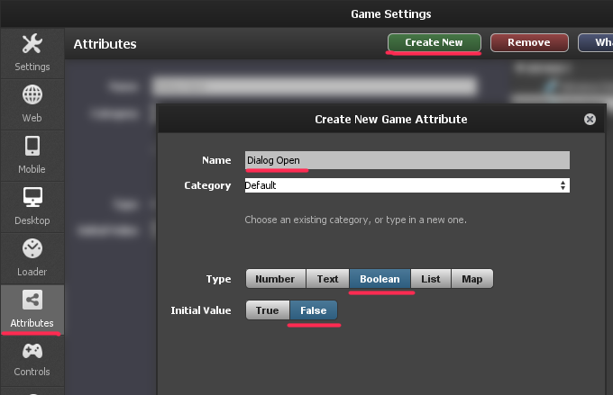
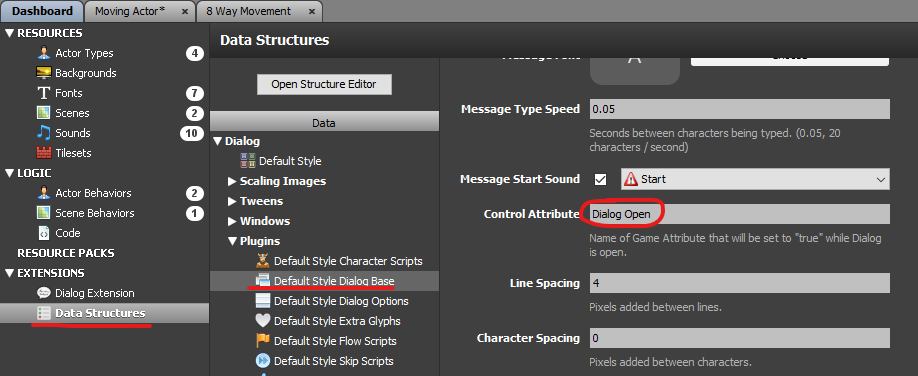
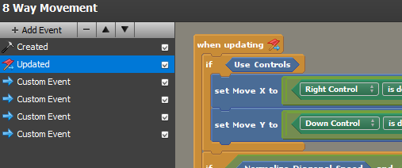
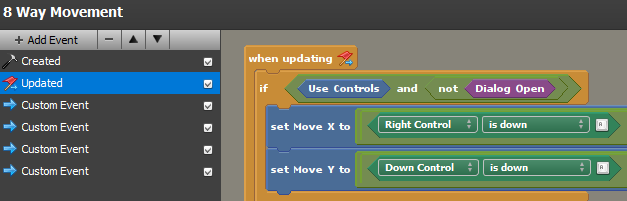

+++
title = "Checking For Active Dialog"
+++

It's common to want to check whether or not dialog is currently active. For example, you may wish to prevent character movement when dialog is being displayed.

The dialog extension provides a built-in mechanism for determing if dialog is currently active, without having to keep track of this yourself. The way this is done is by allowing you to specify a Game Attribute that you want to be `true` when dialog is active, and `false` when it's not.

### 1. Create a Game Attribute

**Settings > Attributes > Create New**

Create the attribute with the following settings

- **Name**: `Dialog Open`
- **Type**: Boolean
- **Initial Value**: False

> 💡 **Note**: The **Name** of the Game Attribute can be anything you want it to be. For the purpose of this guide, we will call it "Dialog Open".

### 2. Set it as the Dialog Control Attribute

**Data Structures > Plugins/Default Style Dialog Base > Control Attribute**

This is the setting that determines the name of the game attribute to set to `true` or `false`. Set this to the name of the Game Attribute you just created, `Dialog Open`.

### 3. Preventing Movement

To actually use the Control Attribute to prevent player movement will vary on a case-by-case basis. Only you can determine the best way to do this. However, I'll show one example using Stencyl's built-in "8 Way Movement" behavior.

"8 Way Movement" checks a boolean, "Use Controls", to determine whether it should look at up/down/left/right inputs and move the actor.

If "Use Controls" is `false`, there will be no input checks, and thus no movement. We can add a condition here, to additionally prevent input checks if dialog is currently active.

